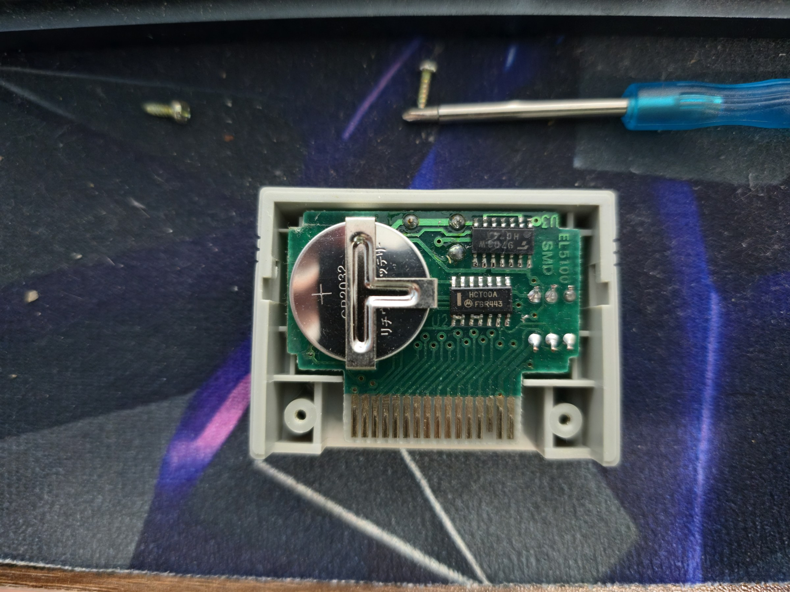
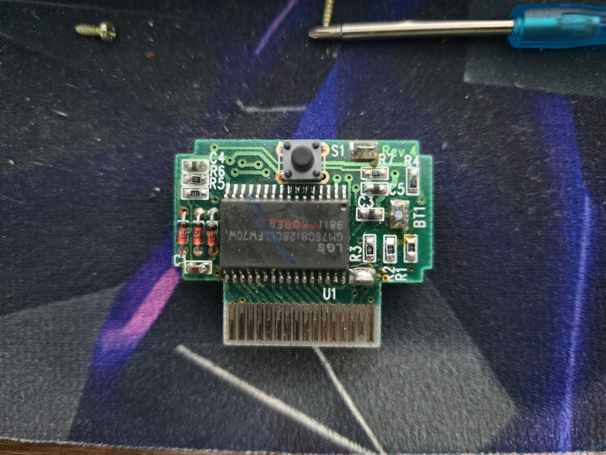
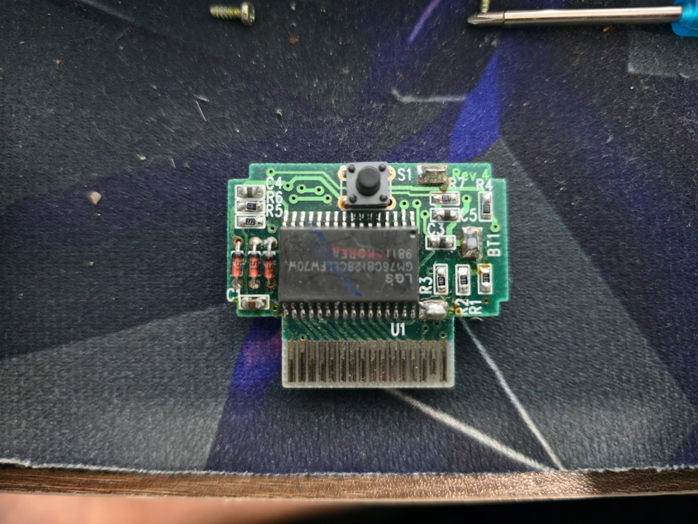

# Custom RP2040 Rumble Pak — Design Notes

Goal: convert a broken aftermarket **N64 Controller (Memory) Pak** into a working
**Rumble Pak** by reusing its edge connector and driving a motor with our own
microcontroller. This document captures the plan and the open questions; it is a
living design doc, not a finished build.

> Status: **planning / pre-build.** Hardware design is committed; firmware and the
> protocol-dependent details are still open (see [Open Items](#open-items)).

## Background: why a Memory Pak is not a Rumble Pak

From the console's side, both accessories share the **same physical edge connector**
and the **same parallel, SRAM-style bus**. The N64 *controller's* own chip does the
serial↔parallel translation, so to any accessory the world looks like a memory-mapped
device: address lines `A0–A15`, data `D0–D7`, strobes `/CE` `/WE` `/OE`, plus
`3.3V` / `GND` / `DETECT`.

What hangs off that bus differs completely:

| | Memory (Controller) Pak | Rumble Pak |
|---|---|---|
| Brain | 32 KB SRAM + backup battery | Custom decode/latch chip |
| Output | Stores / returns bytes | Drives a motor via a transistor |
| Power | Coin cell (SRAM retention) | AAA battery (motor) |

So the Memory Pak has **no rumble logic and no motor driver** — but its board breaks
out the entire accessory bus to the SRAM pads, which makes it a good **donor** for the
connector and bus fan-out.

## Donor board identification

Aftermarket (3rd-party) N64 Controller Pak, bank-switched:

- **U1:** `GM76C8128CLLFW70` — LG/Goldstar **128 KB SRAM** (128K×8, 1 Mbit, 70 ns),
  date code `9811`.
- **CR2032** coin cell (SRAM data-retention backup).
- A 74HC-family logic gate (chip-select / battery write-protect gating) and a small
  `U3`; a pushbutton `S1`. The 128 KB SRAM + glue + button indicates a **multi-page /
  bank-switched** pak (128 KB paged as several virtual 32 KB paks).

Because the bank-switch glue sits in the address/CE path, we will **not** rely on the
original SRAM to answer the rumble detection probe. The plan strips the board down to
the **bare edge connector** and lets the MCU own the bus entirely.

### Photos

| Front (SRAM side) | Front (alt) | Back (battery / logic side) |
|---|---|---|
|  |  |  |

(Web-sized copies; the camera originals are ~200 MP and were downsized to keep the
public repo lean.)

## EC1 — accessory port edge-connector pinout

32-pin card edge (from the upstream KiCad schematic). Sorted by pin number:

| Pin | Net | Pin | Net |
|----:|-----|----:|-----|
| 1 | GND | 17 | GND |
| 2 | A14 | 18 | A15 |
| 3 | A12 | 19 | /CE (chip enable) |
| 4 | A7 | 20 | /WE (write) |
| 5 | A6 | 21 | A13 |
| 6 | A5 | 22 | A8 |
| 7 | A4 | 23 | A9 |
| 8 | A3 | 24 | A11 |
| 9 | A2 | 25 | /OE (read/output enable) |
| 10 | A1 | 26 | A10 |
| 11 | A0 | 27 | D7 |
| 12 | D0 | 28 | D6 |
| 13 | D1 | 29 | D5 |
| 14 | DETECT | 30 | D4 |
| 15 | 3.3V | 31 | 3.3V |
| 16 | D2 | 32 | D3 |

- Power: `3.3V` = 15, 31 · `GND` = 1, 17
- Address `A0–A15`: 11,10,9,8,7,6,5,4 (A0–A7), 22,23,26,24 (A8–A11), 3,21,2,18 (A12–A15)
- Data `D0–D7`: 12,13,16,32,30,29,28,27
- Control: `/CE` 19, `/WE` 20, `/OE` 25
- `DETECT`: 14

## MCU choice: RP2040 (Raspberry Pi Pico)

Two hard constraints drove the choice:

1. **3.3 V I/O is mandatory.** The bus is 3.3 V; a 5 V part can damage the console's
   controller IC. (Rules out classic 5 V Arduino Nano/Uno.)
2. **Reads must be answered within ~70 ns.** Once the SRAM is removed, the MCU drives
   the data bus on reads of the ID region. A 16 MHz AVR (62.5 ns/instruction) cannot
   decode an address and drive data in that window. This needs a deterministic
   hardware bus engine.

The **RP2040** satisfies both: 3.3 V native, ~26 usable GPIO, and **PIO** state
machines for cycle-exact bus response. Proven in the N64 homebrew scene. RP2350 /
Teensy 4.x / STM32F4 (FSMC) would also work; RP2040 is the cheapest and simplest.

## Power architecture

**Do not power the Pico from the console 3.3 V rail** — that rail is sized for a tiny
logic chip (a few mA) and an RP2040 can pull 30–50 mA, risking a console brownout.

```
 Battery pack --[F1 fuse]--+-------------> Pico VSYS (pin 39)  -> onboard buck-boost makes 3.3 V
   (>= 1.8 V, see note)    |
                           +------> Motor+ (raw battery, switched by FET)
 Battery- -----------------------> common GND  -- tied to EC1 GND (pins 1, 17)

 EC1 3.3 V (pins 15, 31): LEAVE FULLY UNCONNECTED. Nothing on our board touches the
                          console 3.3 V rail — no power, no DETECT tie, nothing.
```

**No N64 power, ever.** The console's 3.3 V rail is sized for a tiny logic chip and an
RP2040 can brown it out / damage it. Our board never connects to EC1 pins 15/31. The
only wires to the console are the **signal** lines (address, data, strobes, DETECT) and
**GND**.

- The Pico board's onboard regulator is a **buck-boost (RT6150), VSYS 1.8–5.5 V** — feed
  the battery into **VSYS** and it makes 3.3 V regardless. Do not also connect VBUS.
- **DETECT (EC1 pin 14):** drive it from **our own 3.3 V** (Pico `3V3 OUT`, pin 36) — not
  from the console rail. This signals "accessory present" using our power, so the console
  only detects the pak when our circuit is alive (clean dead-battery failure mode).
- **Back-powering caveat:** make sure the Pico is **powered (battery in) whenever the pak
  is inserted into a live N64.** If the Pico is unpowered while the console drives the bus
  lines high, current can leak through the Pico's GPIO clamp diodes into its 3V3 rail. A
  simple battery on/off switch (or just not inserting with a dead battery) avoids this.
- **Battery (chosen): 2× NiMH** (~2.4 V nominal pack; ~2.7 V freshly charged, sagging
  toward ~2.0 V near empty — all within VSYS range). Charged **externally** (no onboard
  charge circuit). Use **low-self-discharge (Eneloop-type)** cells since the pak may sit
  unused. Chosen size: **AAA** (best fit for a pak-sized shell).
  - NiMH's low internal resistance is a plus here: it sources the motor's current spikes
    with less sag, keeping VSYS away from the Pico's 1.8 V floor.
- **Motor:** an ERM rumble motor salvaged from a PlayStation (DualShock) controller
  (~3 V nominal). At 2.4 V it runs a little gentler than rated — acceptable, just softer
  rumble (voltage can't be boosted in firmware). The large "heavy" motor gives strong
  low-frequency rumble (higher stall current); the small motor a lighter buzz. Size the
  FET and PTC fuse to the chosen motor's stall current.
- **Shared-pack brown-out:** motor inrush/stall can momentarily sag the pack and reset
  the Pico if VSYS dips below 1.8 V. Mitigate with a **bulk cap on VSYS** (e.g. 100–
  470 µF) — and if needed a small **diode + cap hold-up** isolating the Pico rail from
  the motor. NiMH's low ESR already helps.
- **Common ground** between battery, Pico, and the console bus is mandatory.
- Tradeoff: the Pico draws idle current from the battery even when not rumbling;
  mitigate in firmware (clock-down / dormant mode between bus accesses).

## Bus → Pico GPIO map

Data bus on **GP0–GP7 contiguous** so PIO can drive/read a byte in one instruction.

| Signal | EC1 pin | Pico GPIO | Dir |
|---|---|---|---|
| D0 | 12 | GP0 | bidir |
| D1 | 13 | GP1 | bidir |
| D2 | 16 | GP2 | bidir |
| D3 | 32 | GP3 | bidir |
| D4 | 30 | GP4 | bidir |
| D5 | 29 | GP5 | bidir |
| D6 | 28 | GP6 | bidir |
| D7 | 27 | GP7 | bidir |
| /CE | 19 | GP8 | in |
| /OE (read) | 25 | GP9 | in |
| /WE (write) | 20 | GP10 | in |
| A0 | 11 | GP11 | in |
| A1 | 10 | GP12 | in |
| A2 | 9 | GP13 | in |
| A3 | 8 | GP14 | in |
| A4 | 7 | GP15 | in |
| A13 | 21 | GP16 | in |
| A14 | 2 | GP17 | in |
| A15 | 18 | GP18 | in |
| A12 | 3 | GP19 | in |
| MOTOR_EN | — | GP22 | out |
| GND | 1, 17 | GND pins | — |
| DETECT | 14 | *tie to Pico 3V3 OUT (pin 36) — our power, not the console's* | — |
| 3.3 V | 15, 31 | *FULLY UNCONNECTED* | — |

**Why only 8 of 16 address lines?** The resolved protocol (see below) shows the only
region selectors that matter are **A14 and A15**; `A0–A4` (block offset) and `A12/A13`
(guards) are kept only for robustness. This leaves **GP20, GP21, GP26–GP28 free**.

- Add **33–100 Ω in series** on each bus line between EC1 and the Pico for
  contention/ESD protection — negligible at these speeds.

## Motor driver stage (low-side, logic-level FET)

```
 Battery+ -[F1]-+---------------+---------> Pico VSYS
                |            [Motor JP1]
              (Cbulk          |   ^
              47-100uF)    +---+--+ D1 flyback (SS14 / 1N5819),
                |          | =||= |  cathode -> Motor+ side
                |          +---+--+
                |          Drain
 GP22 -[100R]---+-- Gate -- Q1: AO3400A (logic-level N-MOSFET)
                |          Source
              [100k]           |
              pulldown         |
                +--------------+---------> common GND
```

- **AO3400A** (or similar logic-level N-FET): 3.3 V gate drive fully enhances it and it
  handles a vibration motor easily. (A 2N7002 only suits a very small ~200 mA motor.)
- **Gate pulldown 100 kΩ → GND** keeps the motor **off at power-up**, while the Pico
  GPIOs are still Hi-Z inputs before firmware runs. Important.
- **Flyback Schottky across the motor is mandatory** — the inductive kick otherwise
  destroys the FET and injects noise onto the bus.
- **100 nF ceramic across the motor terminals** for brush noise; **100 nF + 10 µF at
  VSYS**.
- **Fuse** sized just above motor stall current (a resettable PTC is convenient).

## Firmware shape (sketch — to be finalized)

Two PIO state machines on one RP2040 (decode is just A14 + A15 + data + strobes):

- **Read SM:** on `/CE` & `/OE` with `A15=1, A14=0` (ID region `0x8000–0xBFFF`), drive
  `D0–D7` = **`0x80`** (a *fixed* value — only D7 high — not an echo) within the ~70 ns
  window, then tristate. PIO is what makes the window achievable. Reads elsewhere can be
  ignored (no SRAM to emulate).
- **Write SM:** on `/CE` & `/WE` with `A15=1, A14=1` (motor region `0xC000–0xFFFF`),
  sample **D0** and set **MOTOR_EN (GP22)** accordingly (`1` = on, `0` = off). Writes
  are not latency-critical.

Low-power: clock-down / dormant between accesses to limit idle battery drain.

A first draft of this firmware lives in [`firmware/`](firmware/) (two PIO programs +
the CPU motor-decode loop, with the hardware-validation points called out).

## Rumble protocol (resolved)

Confirmed from libdragon / qwertymodo, the bitbuilt CNT-NUS thread, and a practical
build writeup (phoboslab). On the parallel accessory bus the MCU sees plain byte
addresses `A0–A15`; the 5-bit address CRC and 32-byte block framing live on the joybus
(console↔controller) side and never reach us.

| Region | Address | A15 | A14 | Behaviour |
|---|---|:--:|:--:|---|
| Save RAM | `0x0000–0x7FFF` | 0 | – | Controller Pak only; we don't implement it |
| **ID / probe** | `0x8000–0xBFFF` | 1 | 0 | **reads return `0x80`** (fixed; real HW uses a weak pull-up on D7) |
| **Motor** | `0xC000–0xFFFF` | 1 | 1 | **write D0**: `0x01`=on, `0x00`=off |

- **Detection:** the console writes `0xFE` to the `0x8000` block then reads it back —
  a Memory Pak returns `0x00`, a Rumble Pak returns `0x80`. So we simply drive `0x80`
  on any read in the ID region.
- **Motor:** spec is on/off only (no speed). Games vary intensity by **PWM-ing the
  motor across frames**; we just mirror D0 to the FET.
- **DETECT (pin 14):** driven from our own 3.3 V (never the console rail) — see Power
  architecture.

## Added-parts BOM

RP2040 Pico · AO3400A FET · SS14/1N5819 Schottky · 100 Ω gate R + 100 kΩ pulldown ·
~20× 33–100 Ω bus resistors · PTC fuse · 47–100 µF + 100 nF (motor) · 100–470 µF VSYS
bulk + 10 µF + 100 nF (VSYS) · 2× NiMH cells (LSD/Eneloop) + 2-cell holder + on/off
switch.

## Open Items

Resolved (see [Rumble protocol](#rumble-protocol-resolved) and Power architecture):
- ~~ID-probe + motor addresses/values~~ → ID read = `0x80` at `0x8000`; motor = D0 at
  `0xC000`.
- ~~DETECT pin handling~~ → drive pin 14 from our own 3.3 V (Pico pin 36); console
  3.3 V rail left fully unconnected.
- ~~Reduced address decode~~ → only A14/A15 needed; A0–A4, A12/A13 kept for robustness.

Remaining:
1. **Confirm the ~70 ns read window on real hardware** with a logic analyzer — measure
   how long after `/OE` the controller latches data, to validate the PIO read timing.
2. **PS-controller motor stall current** — sets the PTC fuse rating.
3. **Bench-validate detection** with a real N64 + a rumble game (or a libdragon test).

## Enclosure (future work)

A custom 3D-printed shell comes **last**, once the internal layout (Pico + battery +
motor placement) is fixed. Constraints to design around:

- The **card-edge geometry is fixed** by the donor PCB — it must match the controller
  slot (finger pitch, thickness, insertion depth). The shell keys off that edge.
- **Motor mounting** wants a little damping, or the pak buzzes against the controller
  instead of transmitting rumble.
- **Battery access** — a **removable hatch** for the 2× NiMH cells (charged externally),
  ideally with a small **on/off switch** on the pack (also avoids the back-power case).

## References

- Upstream schematic: `../N64 Rumble Pak/` (this repo's fork parent, `Ugly-Mug/N64`).
- N64 controller expansion-port pinout + DETECT: bitbuilt.net CNT-NUS thread (#4852),
  cited in the upstream v2 schematic title block.
- Rumble protocol (addresses/values): libdragon (`joybus_accessory`), and the phoboslab
  build writeup "A Nintendo 64 Rumble Pak so Bad that it's Good" (2026).
